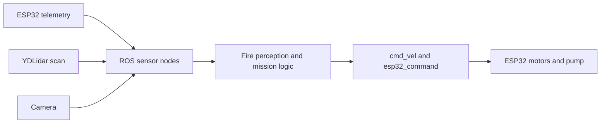

# System Overview

PyroPatrol Rover Control is split into two main parts:

- Raspberry Pi 4 runs ROS 2, perception, mission logic, video, and app connectivity.
- ESP32-S3 handles low-level actuation and sensor telemetry.

The rover is meant for local fire response rather than map-building. The main sensing loop combines:

- YDLidar for local obstacle detection
- camera input for video and ArUco detection
- ESP32 telemetry for fire-related sensing
- AI fire perception for direction and severity estimation

## Runtime Goal

At runtime, the stack is always trying to answer three questions:

1. Is it safe to move?
2. Where is the fire relative to the rover?
3. Is the signal strong enough to justify a pump action?

## High-Level Flow

## Key Runtime Topics

| Topic | Meaning |
|---|---|
| `/esp32_telemetry` | raw JSON telemetry from ESP32 |
| `/esp32_command` | drive, scan, pump, and status commands back to ESP32 |
| `/scan` | lidar obstacle readings |
| `/camera/image_raw` | live camera frames |
| `/aruco/pose` | detected marker pose |
| `/mission/fire_perception` | AI-predicted fire direction and severity |
| `/cmd_vel` | motion command for the base |

## Launch Entry Point

The main system launch file is:

`src/frr_bringup/launch/esp32_rover_bringup.launch.py`

That launch file starts the ESP32 bridge, telemetry parser, fire perception node, mission controller, camera, streaming node, and optional lidar.
