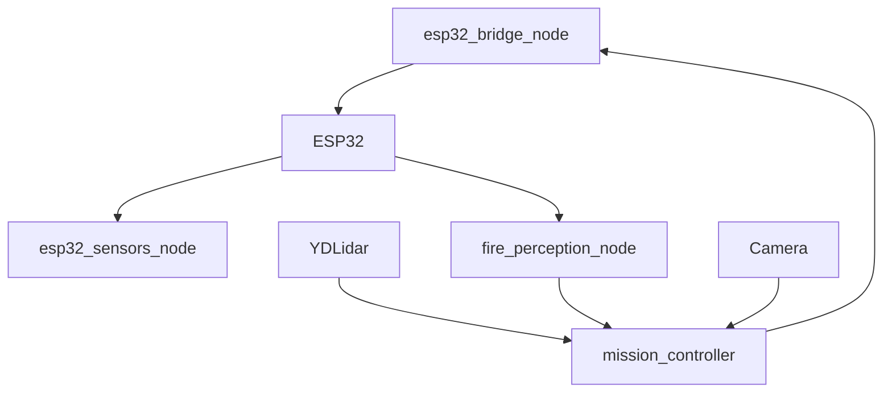

# ROS Components

## `frr_bringup`

This package launches the integrated rover stack.

Main launch file:

- `esp32_rover_bringup.launch.py`

Key launch arguments:

- `serial_port`
- `enable_lidar`
- `enable_fire_perception`
- `enable_video_stream`
- `ws_port`

## `frr_control`

### `esp32_bridge_node`

- converts ROS commands into ESP32 serial commands
- forwards pump and drive actions to the controller
- republishes ESP32 telemetry into ROS

### `mission_controller`

- owns autonomous mode logic
- consumes AI predictions from `/mission/fire_perception`
- decides when to turn, stop, or trigger the pump

### `ws_bridge_node`

- bridges rover commands and telemetry to the Flutter app over WebSocket

## `frr_sensors`

### `esp32_sensors_node`

- parses raw ESP32 JSON into more focused ROS topics

### `camera_node`

- publishes camera frames
- detects ArUco markers

### `ultrasonic_node`

- provides a front-distance fallback when lidar is unavailable

### `fire_perception_node`

- buffers `LEFT`, `FRONT`, and `RIGHT` scan sectors
- loads the packaged MSCNN runtime model
- publishes direction and severity to `/mission/fire_perception`

## `frr_navigation`

This package contains motion and autonomous behavior nodes used by the rover stack.

Examples include:

- autonomous navigation logic
- firebot behavior nodes
- ArUco follower behaviors

## `frr_video`

### `streamer_node`

- serves camera frames over HTTP/MJPEG
- supports the operator dashboard and app-side video view

## Runtime Wiring

